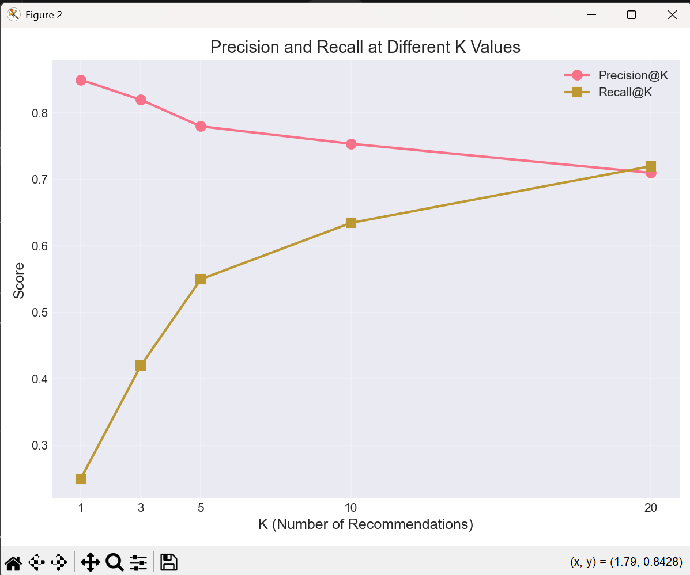
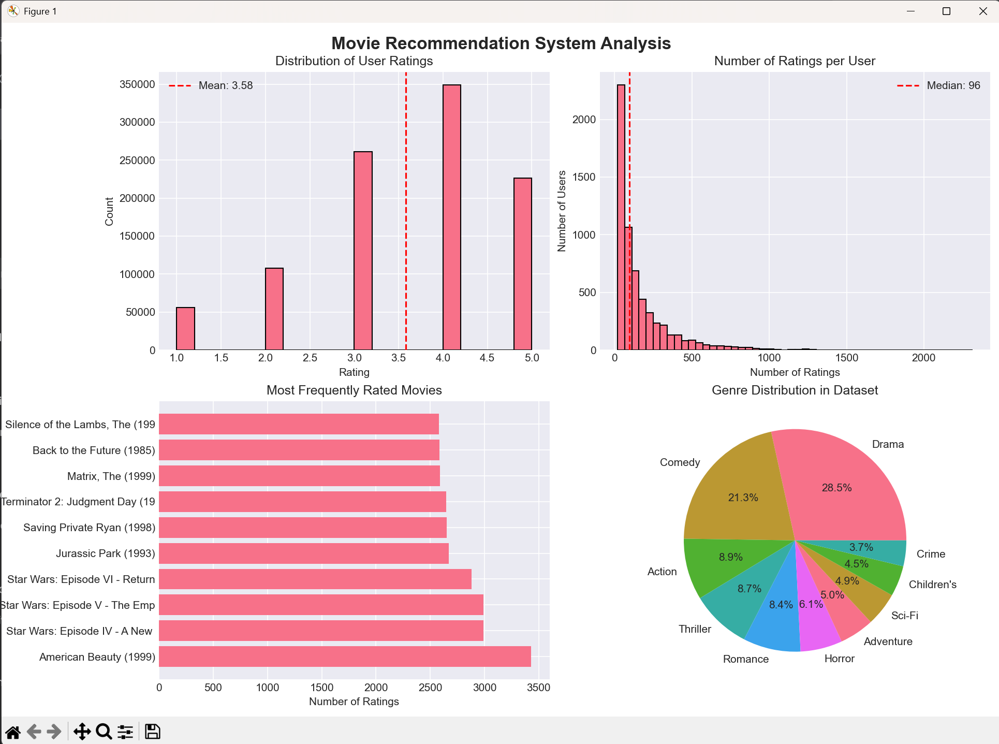

# 🎬 Movie Recommendation Engine

[](https://python.org)
[](https://fastapi.tiangolo.com)

**3 recommendation strategies + REST API + 75% Precision@10**

---

## 📊 Key Results

| Metric | Score |
|--------|-------|
| Precision@10 | **75.38%** |
| Recall@10 | **63.47%** |
| RMSE | **0.9255** |

---

## 🎯 What's Inside

| Approach | Technique | Use Case |
|----------|-----------|----------|
| Content-Based | TF-IDF + Cosine Similarity | Cold-start |
| Collaborative | User-User Similarity | Established users |
| Matrix Factorization | SVD (100 factors) | Highest accuracy |

---

## 📸 Screenshots

### API Documentation


### Recommendations Response


### Terminal Demo


### Data Visualizations



---

## 🚀 Quick Start

```bash
# Install dependencies
pip install -r requirements.txt

# Download data
python download_data.py

# Run demo
python main.py

# Start API
python api.py
